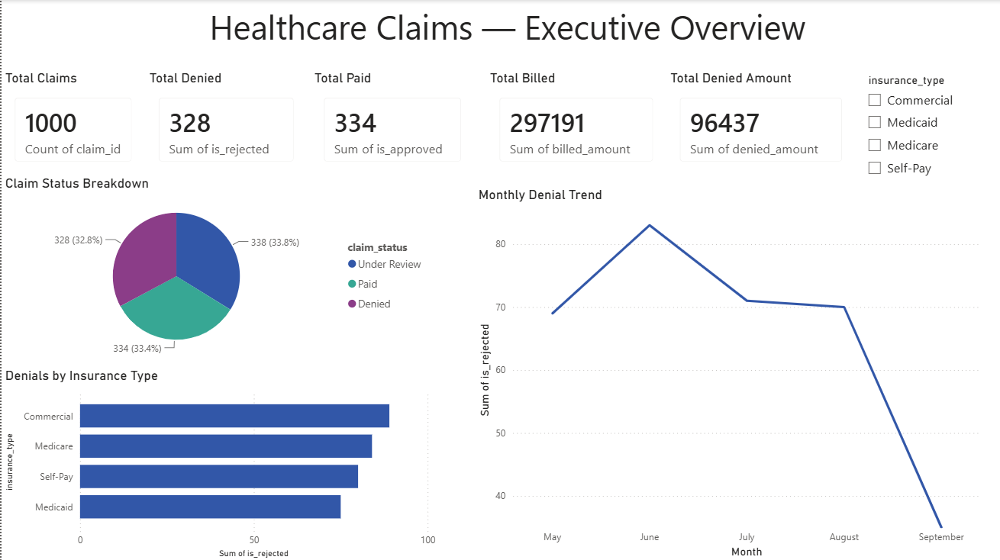
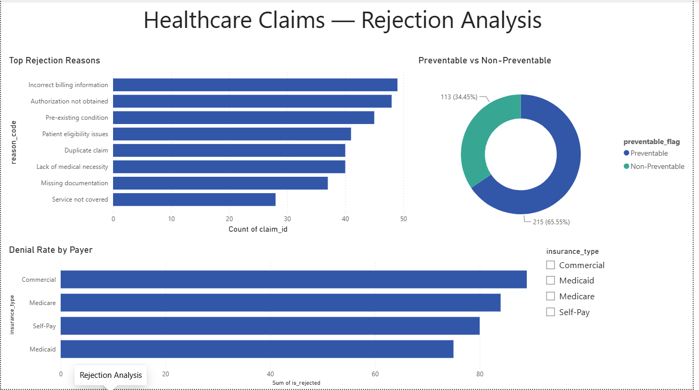
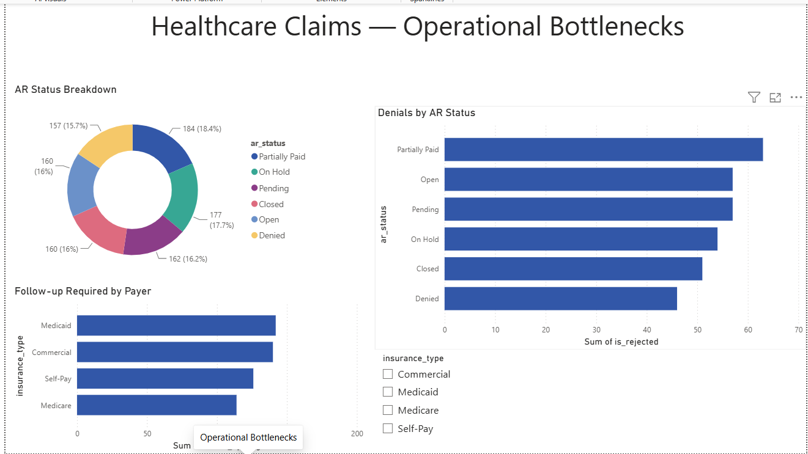
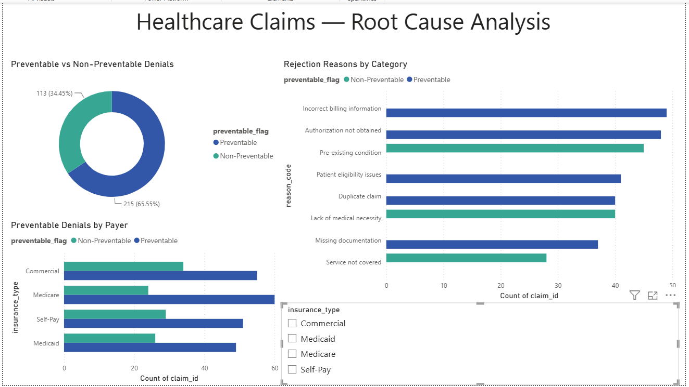

# Healthcare Claims Analytics Dashboard
> *Turning claims data into operational clarity — from denial root causes to approval rate trends and processing efficiency.*

---

## The Problem

Healthcare organizations lose significant time and revenue when claims are rejected, delayed, or incorrectly processed. For operations teams, the challenge is rarely a lack of data — it's a lack of *visibility*. Rejection trends go undetected, processing bottlenecks persist across quarters, and root causes remain buried in raw exports.

This project builds an end-to-end analytics solution that transforms raw claims data into actionable intelligence, enabling operations teams to reduce rejection rates, identify systemic bottlenecks, and prioritize process improvements with evidence. This project uses a publicly available healthcare insurance dataset (Kaggle) to simulate a real-world claims operations analysis scenario.

---

## Business Objective

This dashboard answers six questions that operations leaders actually ask:

| # | Business Question |
|---|-------------------|
| 1 | Which rejection reasons occur most frequently — and are they preventable? |
| 2 | Which payers have the highest rejection rates? |
| 3 | Are rejections trending up or down month over month? |
| 4 | What is the financial impact of denied claims? |
| 5 | Which AR statuses have the most unresolved denials? |
| 6 | Where are the highest-impact opportunities to reduce rejections? |

---

## Dataset

| Attribute | Detail |
|-----------|--------|
| **Source** | [Healthcare Claims Dataset by lakshmijetty](https://www.kaggle.com/datasets/lakshmijetty/healthcare-claims-dataset) |
| **Size** | 1,000 claims records |
| **Time Period** | May 2024 — September 2024 |
| **Format** | CSV |

**Key Columns:**

| Column | Description |
|--------|-------------|
| `claim_id` | Unique claim identifier |
| `date_of_service` | Date claim was submitted |
| `insurance_type` | Insurance type — Commercial, Medicare, Medicaid, Self-Pay |
| `billed_amount` | Total amount billed |
| `allowed_amount` | Amount approved by insurer |
| `paid_amount` | Amount actually paid |
| `claim_status` | Paid / Denied / Under Review |
| `reason_code` | Reason for denial if applicable |
| `follow_up_required` | Whether follow-up action is needed |
| `ar_status` | Accounts receivable status |

---

## Tools & Technologies

| Tool | Purpose |
|------|---------|
| **SQL (SQLite / DB Browser)** | Data cleaning, transformation, exploratory analysis |
| **Power BI** | Interactive dashboard and visualization |
| **GitHub** | Version control and project documentation |

---

## Project Structure

```
healthcare-claims-analytics-dashboard/
├── data/
│   └── README.md                   # Dataset source and reproduction steps
├── sql/
│   ├── data_cleaning.sql           # Null handling, standardization, feature engineering
│   └── exploratory_analysis.sql    # EDA queries and KPI analysis
├── dashboard/
│   └── Healthcare_Claims_Dashboard.pbix
├── screenshots/
│   ├── dashboard-overview.png
│   ├── rejection-analysis.png
│   ├── operational-bottlenecks.png
│   └── root-cause-analysis.png
├── documentation/
│   └── data_dictionary.md          # Column definitions and feature descriptions
└── README.md
```

---

## Dashboard Overview

The dashboard is structured across four analytical pages:

**Page 1 — Executive Overview**
High-level KPIs: total claims, total denied, total paid, total billed, and total denied value. Includes claim status breakdown and monthly denial trend filtered by insurance type.

**Page 2 — Rejection Analysis**
Drill-down into what is being rejected and why. Top rejection reasons ranked by volume, denial rate by payer, and preventable vs non-preventable breakdown.

**Page 3 — Operational Bottlenecks**
AR status distribution, denials by AR status, and follow-up required by payer.

**Page 4 — Root Cause Analysis**
Preventable vs non-preventable rejection classification, breakdown by payer, and rejection reasons colored by category.

---

## Screenshots

### Executive Overview


### Rejection Analysis


### Operational Bottlenecks


### Root Cause Analysis


---

## Key Findings

- **32.8%** of all claims were denied — representing **$96,437** in denied value out of $297,191 total billed.
- **Incorrect billing information** was the single largest rejection reason with 49 cases, followed by Authorization not obtained (48) and Pre-existing condition (45).
- **Medicare** had the highest denial rate at **36.05%**, the highest among all payers.
- **65.55%** of all denials were caused by preventable reasons — process and administrative errors that can be fixed operationally.
- Denial rate **peaked in June 2024 at 36.24%** and improved to **26.72% in September** — indicating early signs of process improvement.
- **$62,684** in denied claims was potentially preventable based on preventable rejection classification.

---

## Recommendations

1. **Fix billing errors first** — Incorrect billing information is the top rejection reason and fully preventable. Implement a pre-submission validation checklist for billing codes.

2. **Focus on Medicare claims** — With a 36% denial rate, Medicare claims need dedicated review before submission. Consider a separate workflow for Medicare-specific requirements.

3. **Target authorization errors** — Authorization not obtained is the second largest preventable reason. Build an authorization checklist into the pre-submission process.

4. **Monitor monthly denial trends** — The drop from 36% in June to 27% in September shows improvement is possible. Continue tracking monthly to sustain the trend.

5. **Clear Partially Paid AR** — Partially Paid claims show the highest denial counts in AR. Prioritize follow-up on these to recover outstanding value.

---

## Author

**Vigneshwari**

MSc Data Analytics for Business — KEDGE Business School, France

[LinkedIn](https://www.linkedin.com/in/vigna24/) | [Portfolio](https://vigneshwari2408.github.io/vigneshwari-portfolio/)

---

*Built to demonstrate end-to-end analytics thinking: from business problem definition through SQL analysis to operational dashboard delivery.*
